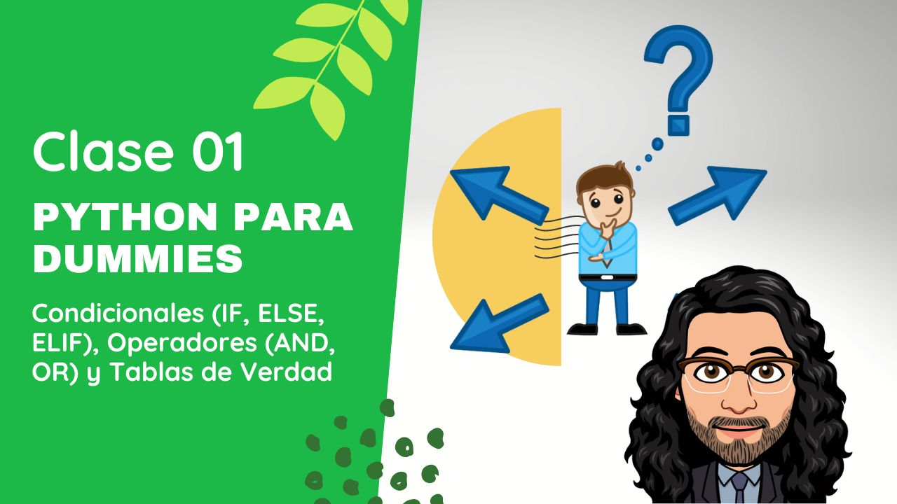

# Python Para Dummies MisionTIC2022

## Curso para aprender el lenguaje de programación Python desde cero y para principiantes

## Clases en vídeo

### Curso de fundamentos desde cero

Curso que agrupa todas las clases que hacen referencia a los fundamentos de Python.

> Código: Todo el código se encuentra en la raiz de este repositorio de Github

* [Lección 1 - Condicionales (IF, ELSE, ELIF), Operadores (AND, OR) y Tablas de Verdad](https://youtu.be/Nfw6_mWWslc)
* [Lección 2 - Ciclos (FOR, WHILE)](https://youtu.be/pgeZyaATFKk)
* [Lección 3 - Mis Primeros Programas y Algoritmos en Python](https://youtu.be/vCheu3BKyB0)
* [Lección 4 - Listas, Diccionarios y conceptos de POO (Herencia, Clases, Objetos)](https://youtu.be/GFUcvYLv7ps)
* [Lección 5 - Ejercicios y Retos con Strings, Listas y Diccionarios](https://youtu.be/IDiuAJLpin4)
* [Lección 6 - Lista de Listas "Matrices" tanto en Programación Secuencial cómo en POO](https://youtu.be/igKohpBzTes)
* [Lección 7 - Programación Orientada a Objetos (POO)](https://youtu.be/P-lT94ETL8U)
* [Lección 8 - Estructuras de Datos: Listas Ligadas, Pilas y Colas](https://youtu.be/SWmtsp9keHU)
* [Lección 9 - Ejercicio de Análisis de Datos de Casos COVID-19 en Colombia](https://youtu.be/H4-rA85mN_s)
* [Lección 10 - Ejercicios y Retos con Lectura y Escritura de datos CSV y JSON](https://youtu.be/xHQln4d2XBU)
* [Lección 11 - Programar Juegos en Python](https://youtu.be/s6MFl0IotJ0)

## Información importante y preguntas frecuentes

Actualmente el curso está finalizado. Se han realizado varios ejercicios prácticos y se explican varios conceptos vistos en el programa de MisionTIC 2022 del Ministerio de Tecnologías de la Información y Comunicaciones de Colombia (MinTIC), ese era el objetivo inicial del proyecto.

¡Muchísimas gracias por todo el apoyo mostrado!

## Enlaces de interés

* [Web oficial de Python](https://www.python.org/)

#### Puedes apoyar mi trabajo haciendo "☆ Star" en el repo o nominarme a "GitHub Star". ¡Gracias!

